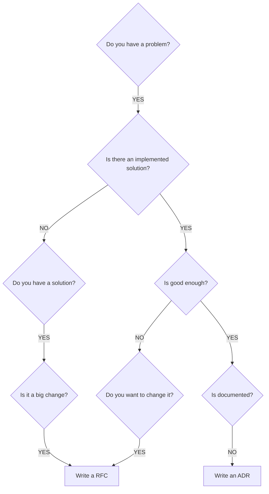

## TL;DR

- Usar RFCs para crear y refinar propuestas técnicas ayuda no solo a generar mejor documentación sino también a mejorar nuestro proceso de decisiones.
- Usar ADRs cómo registro, o historial, de decisiones ayuda también a mejorar el proceso de transmisión de conocimiento del proyecto, comolos ingresos por ejemplo.
- Es recomendable utilizar un template para generar estos documentos de forma rápida: [Documented Software Decisions](https://github.com/emanuelcasco/document-software-decision-template).

## Introducción

Durante el ciclo de vida de un proyecto, **gran parte del tiempo del equipo es dedicado a la toma de decisiones**. La decision a tomar puede ser cómo diseñar un nuevo servicio, qué servicio de terceros utilizar, cómo migrar una base de datos, etc.

La realidad es que los equipos de desarrollo conviven con el cambio como parte de su rutina diaria, y los cambios representan un desvio sobre lo planificada, un problema, que requiere decisiones. **Los sistemas evolucionan, y sin un registro de la misma es dificil entender seguirle los pasos**.

:::quote [Michael Nygard](https://www.michaelnygard.com/)
_"Architecture for Agile projects has to be described and defined differently. Not all decisions will be made at once, nor will all of them be done when the project begins."_
:::

Volver hacia atras y recordar los motivos detrás de una decisión suele ser una tarea complicada, esto trae aparejado el olvido de valioso conocimiento y aprendizajes que pueden perderse con las rotaciones dentro del equipo y el paso del tiempo. Recordando la primer lección de nuestras clases de historia, **aquellos que no recuerdan el pasado están condenados a repetirlo**.

Sin embargo, como menciono al principio del post, este es un problema común y hubo mucha gente antes de nosotros que se enfrento a lo mismo por lo que hay muchas soluciones para este problema. En este post, voy a intentar compartir el _framework_ con el que me he sentido más cómodo trabajando y que, espero, pueda ayudfarlos a ustedes también.

El framework es bastante simple, eso lo hace añun más interesante, y consta tan solo de dos pilares fundamentales:

1. Usar el formato de RFCs para generar e iterar propuestas.
1. Usar el formato de ADRs como registro de decisiones.

## Request for Comments (RFC) para generar e iterar propuestas
%%%%%
A popular template for decision records, which he suggested in the same post, each document should contain the following fields

https://adr.github.io/

## Architectural Decision Records (ADRs) como registro de decisiones

:::quote Decisión de Arquitectura (Architectural Decision - AD)
_"Una Decisión de Arquitectura es una decisión de relacionada con el diseño de software que refiere tanto a requerimientos funcionales como no funcionales que son significativos para la arquitectura de nuestro sistema."_
:::
%TODO% "An Architectural Decision (AD) is a software design choice that addresses a functional or non-functional requirement that is architecturally significant."_

Un Architectural Decision Records (ADR) es un **documento que registra una decisión de arquitectura, el contexto en el cuál la misma fue tomada y sus consecuencias**. Muchas veces, un ADR es el último paso de un proceso de toma de decisiones que incluyó el armado de un documento RFC, pero esto no siempre tiene que ser así.

Algunos beneficios de integrar los ADRs a tu proceso de desarrollo son los siguientes:

- Mejora en la transmición de conocimiento, ya sea en un ingreso o en una rotación en el equipo. Las personas que se suman al proyecto pueden entender rapidamente el estadio y desarrollo del proyecto simplemente leyendo el registro de ADRs.
- Mejor alineación entre los miembros del equipo. Se mitiga el riesgo de decisiones unilaterales que generen impacto en el proyecto sin que hayan sido concensuadas.

### ¿Cuándo se debe escribir un ADR?

Para decidir cuándo tengo que escribir un ADR suelo guiarme por [la definición de Josef Blake del equipo de Spotify](https://engineering.atspotify.com/2020/04/14/when-should-i-write-an-architecture-decision-record/):

:::quote [Josef Blake (Spotify)](https://engineering.atspotify.com/2020/04/14/when-should-i-write-an-architecture-decision-record/)
*¿Cuándo se debe escribir un ADR? Siempre que hayan tomado una decisión que impacte **significativamente** en cómo tu equipo trabaja.*
:::

¿Qué se entiende por *"significativo"*? Es una definición que debe realizar cada equipo, no hay una regla mágica sino que suele ser una construcción en base al criterio y la practica del equipo. %%% Pero si puedo darles una ayuda, si implementan ADR en conjunto con RFC, entonces todo documento RFC que hagan debería tener un documento ADR homonimo.

En las siguientes páginas podrán encontrar ejemplos y herramientas para el diseño de ADRs (agrego también mi template oara ADRs):
- [ADR Tools | Nat Pryce](https://github.com/npryce/adr-tools).
- [ADR Examples | Joel Parker Henderson](https://github.com/npryce/adr-tools).
- [ADR Template | Emanuel Casco](https://github.com/emanuelcasco/document-software-decision-template/blob/main/adr/template.md).

## Consideraciones

La adopción de estás practicas en tu equipo puede no ser sencilla, los procesos de documentación en el desarrollo de software suelen ser un punto de conflicto en los equipos y hay muchas visiones contrapuestas al respecto. Mi primer consejo para alguien que quiera mejorar la documentación en un equipo de desarrollo es: paciencia. Es necesario que la mayoría del equipo este comprometido con el proceso para que este pueda implementarse.

### Consejos para la implementación del framework en tu equipo

- **KISS** (Keep It Stupid Simple), las decisiones suelen ser ya bastante complicadas como para además sumarles un proceso complejo. **Es importante mantener la metodología de trabajo lo más sensilla posible** para que los miembros del equipo se sientan incentivados a seguirla.
- **El proceso debe adaptarse a tu equipo**, no al revés. El _framework_ debe ser iterado por el equipo, de manera que se adapte a sus necesidades.
- **Da el primer paso**. Una vez definida la plataforma donde generar y persistir los documentos, es una buena idea crear un primer documento de cada tipo. Se puede usar la misma implementación de RFC y ADR como caso de ejemplo para que el resto los use de base.
- También **es una buena idea tener templates** de los documentos, e inclusive un generador, para automatizar la generación  de estos archivos.

### Guía práctica de cuándo y cómo documentar

## Conclusiones

Lecturas recomendadas:

- [When should I write an ADR? | Spotify Engineering Blog](https://engineering.atspotify.com/2020/04/14/when-should-i-write-an-architecture-decision-record/)
- http://thinkrelevance.com/blog/2011/11/15/documenting-architecture-decisions
- https://leaddev.com/technical-decision-making/thorough-team-guide-rfcs
- https://brunoscheufler.com/blog/2020-07-04-documenting-design-decisions-using-rfcs-and-adrs
- https://adr.github.io/
- https://github.com/alphagov/govuk-design-system-architecture/blob/main/proposals/001-use-rfcs-and-adrs-to-discuss-proposals-and-record-decisions.md
https://www.rfc-editor.org/rfc-index.html
